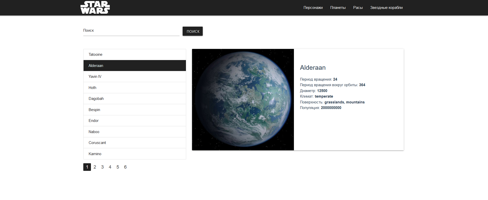

# Star Wars Reference Guide

This is the repository of Star Wars Reference Guide project, which provides information about the Star Wars universe.

### Home page


### Characters Page


## Demo 
Use the app online at: https://starwars-vue.netlify.app

## Built with
* Vue.js
* MaterializeCSS
* Stylus
* NPMz

## How to Use
In order to run this application you will need installed git and NodeJS

```
# Clone this repository
$ git clone git@github.com:artoryas/starwars_vue.git

# Open the repository
$ cd starwars_vue

# Install dependencies
$ npm install

# Run the app
$ npm run serve
```


## Build

Run `ng build` to build the project. The build artifacts will be stored in the `dist/` directory. Use the `--prod` flag for a production build.


### Compiles and minifies for production
```
npm run build
```

### Customize configuration
See [Configuration Reference](https://cli.vuejs.org/config/).
